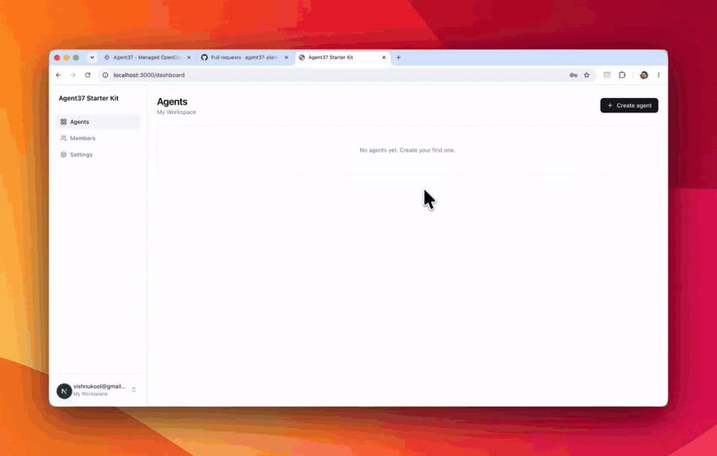

# robyn

A branded agent dashboard on the [Agent37](https://www.agent37.com) Cloud API: auth, Hermes agents, chat, files, messaging apps (Telegram, WhatsApp, Slack, Discord), integrations, schedules, and fleet management.

Each agent's **Schedule** tab manages [Agent37 crons](https://www.agent37.com/docs/agents-api/crons): recurring instructions with a timezone, pause/resume, run now, and run history linked to Chat conversations. Access stays scoped to the agent's workspace. Jobs can wake sleeping agents, skip explicitly stopped agents, and use the agent's normal compute and model budget. No extra database setup or scheduler is required.

Enable an optional [Inkbox](https://www.agent37.com/docs/agents-api/imessage) identity in an agent's **Messaging → Enable Inkbox** for its email inbox, iMessage and calls. Creating or viewing an agent never consumes an Inkbox identity. Add the server-only `INKBOX_ADMIN_KEY` and run `npm run setup` to apply the identity-state migration. Enabling Inkbox restarts that agent once; failed setup can be retried with the same identity.

The inbox allowlist uses the agent creator's account email. Add an allowed phone number in Messaging and send the displayed connection message to activate iMessage and calls. Inkbox's hosted voice agent handles calls and delivers transcripts to Hermes. Deleting an agent also deletes its Inkbox identity and revokes its scoped keys.

<p align="center">
  
</p>

## Setup

**1. Get two keys** (both behind a login, so only you can fetch them):

- `AGENT37_API_KEY` — Agent37 dashboard → **Cloud → API keys**, then **fund the wallet** (Cloud → Billing).
- `SUPABASE_ACCESS_TOKEN` — [supabase.com/dashboard/account/tokens](https://supabase.com/dashboard/account/tokens).

**2. Hand it to your coding agent.** Open this folder in Claude Code / Codex and paste:

```
Set this repo up and run it locally, end to end — follow SETUP.md. Ask me for the two
login-gated keys it needs, then do everything else and tell me the local URL.
```

It writes your keys, configures Supabase, and starts the app. Prefer to do it yourself?
**[SETUP.md](SETUP.md)** has the four-command path and deploy steps too.
